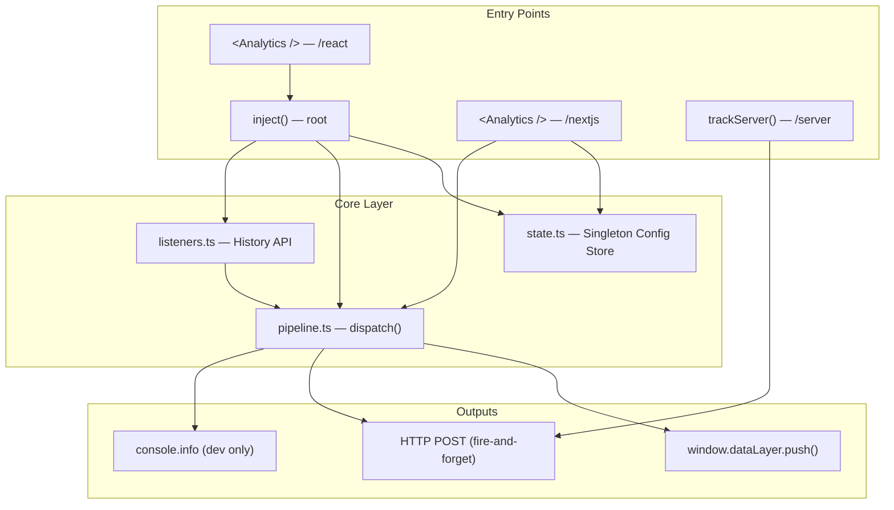
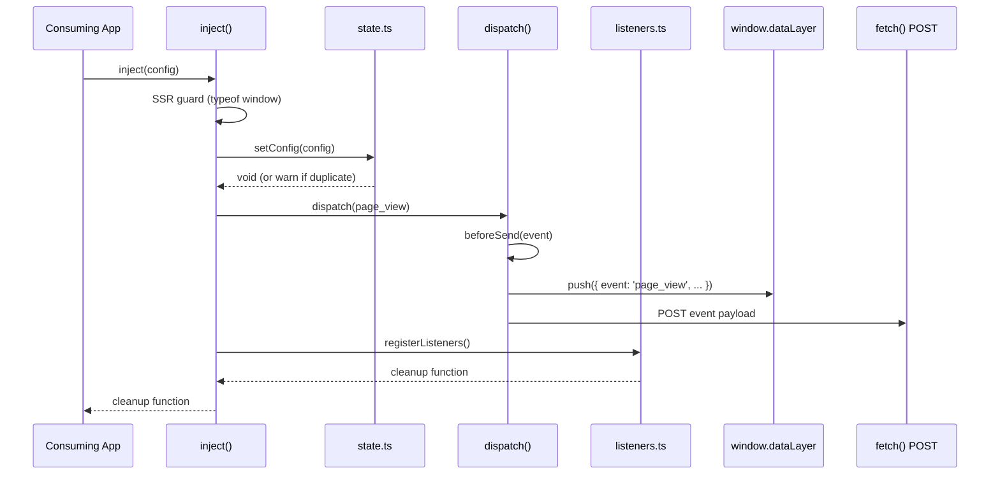
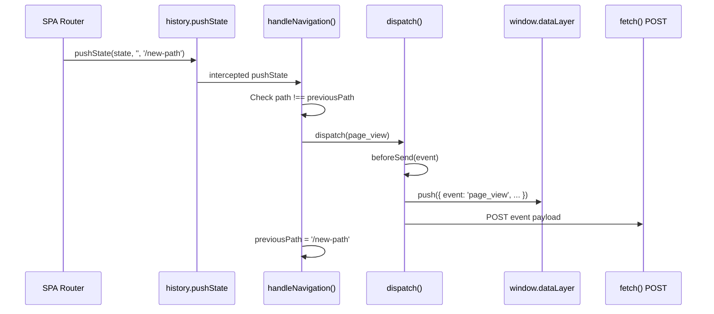
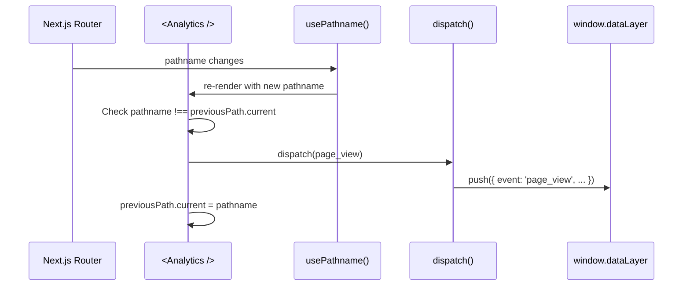
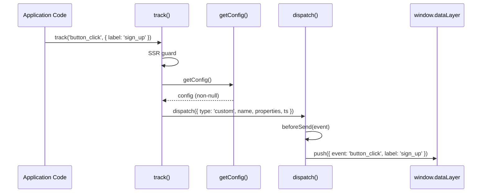

# Design Document: @providirect/analytics (GTM Rewrite)

## Overview

`@providirect/analytics` is a lightweight TypeScript analytics package that replaces the existing GTM-based tracking setup with a clean, framework-agnostic dispatch pipeline. The package provides a singleton configuration store, a unified event pipeline (dataLayer push + HTTP POST), and framework adapters for React, Next.js App Router, and server-side Node.js/Edge runtimes.

The core design principle is simplicity: events flow through a single `dispatch()` function that handles dataLayer pushes, dev logging, and HTTP delivery. The package is consumed as a git dependency and targets < 10KB gzipped for the full client bundle. GDPR consent is explicitly a consuming-app responsibility — the package provides no built-in consent mechanism.

The architecture separates concerns into a state layer (singleton config), a pipeline layer (event dispatch), and adapter layers (framework-specific integration points). This separation enables tree-shaking — apps using only the Next.js adapter pay no cost for History API listener code.

## Architecture



## Sequence Diagrams

### Client-side Initialisation (inject)



### SPA Navigation (History API)



### Next.js App Router Navigation



### Custom Event Tracking



## Components and Interfaces

### Component 1: Singleton Config Store (`state.ts`)

**Purpose**: Module-level singleton that holds the analytics configuration. Ensures `inject()` can only initialise once per page lifecycle.

**Interface**:
```typescript
interface ConfigStore {
  setConfig(config: AnalyticsConfig): void;
  getConfig(): AnalyticsConfig | null;
  _resetConfig(): void; // test-only
}
```

**Responsibilities**:
- Store a single `AnalyticsConfig` instance at module scope
- Reject duplicate `setConfig()` calls with a dev-mode warning
- Provide `_resetConfig()` for test isolation between test cases
- Return `null` from `getConfig()` when uninitialised (callers become no-ops)

### Component 2: Dispatch Pipeline (`pipeline.ts`)

**Purpose**: Central event processing function that every client-side event flows through. Handles beforeSend transformation, dataLayer push, dev logging, and HTTP delivery.

**Interface**:
```typescript
interface Pipeline {
  dispatch(event: AnalyticsEvent): void;
}
```

**Responsibilities**:
- Apply `beforeSend` synchronously (null return = drop event)
- Push transformed event to `window.dataLayer` in GTM-compatible flat format
- Log events to console in development mode
- Fire HTTP POST with 5s timeout, fire-and-forget semantics
- Swallow all errors in production mode

### Component 3: History API Listeners (`listeners.ts`)

**Purpose**: Intercepts browser navigation events (pushState, replaceState, popstate) to automatically track SPA page views without framework coupling.

**Interface**:
```typescript
interface NavigationListeners {
  registerListeners(): () => void; // returns cleanup function
}
```

**Responsibilities**:
- Monkey-patch `history.pushState` and `history.replaceState`
- Listen for `popstate` events (browser back/forward)
- Deduplicate by comparing current path to previous path
- Provide a cleanup function that restores original History API methods
- Guard against double-registration (return existing cleanup if already active)

### Component 4: Root Entry Point (`inject.ts`)

**Purpose**: Primary initialisation function for client-side analytics. Sets config, fires initial page view, and registers navigation listeners.

**Interface**:
```typescript
function inject(config?: AnalyticsConfig): () => void;
```

**Responsibilities**:
- SSR guard: return no-op cleanup if `typeof window === 'undefined'`
- Call `setConfig()` to store configuration
- Dispatch initial `page_view` event with current URL and `document.referrer`
- Call `registerListeners()` and return the cleanup function

### Component 5: Custom Event API (`track.ts`)

**Purpose**: Public API for firing custom analytics events from application code.

**Interface**:
```typescript
function track(
  name: string,
  properties?: Record<string, string | number | boolean | null>
): void;
```

**Responsibilities**:
- SSR guard: no-op if `typeof window === 'undefined'`
- Verify config exists (warn in dev if `track()` called before `inject()`)
- Dispatch custom event through the pipeline

### Component 6: React Adapter (`react/index.tsx`)

**Purpose**: React component wrapper that calls `inject()` in a `useEffect` and returns cleanup on unmount.

**Interface**:
```typescript
function Analytics(props: AnalyticsConfig): null;
export { track } from '../track';
```

**Responsibilities**:
- Call `inject()` once on mount via `useEffect([], [])`
- Return cleanup function from useEffect for proper teardown
- Re-export `track()` for convenient single-import usage
- Uses History API mode (suitable for non-Next.js React apps)

### Component 7: Next.js Adapter (`nextjs/index.tsx`)

**Purpose**: Next.js App Router-specific component that uses `usePathname()` as the sole navigation signal, avoiding the History API entirely.

**Interface**:
```typescript
function Analytics(props: AnalyticsConfig): null;
export { track } from '../track';
```

**Responsibilities**:
- Call `setConfig()` directly (NOT `inject()` — avoids History API registration)
- Dispatch initial `page_view` on mount
- React to `usePathname()` changes for subsequent navigations
- Deduplicate via `useRef` to prevent double-firing
- Re-export `track()` for convenient single-import usage

### Component 8: Server Export (`server/index.ts`)

**Purpose**: Standalone function for tracking events from Node.js or Edge runtimes via HTTP POST only (no dataLayer).

**Interface**:
```typescript
function trackServer(options: ServerTrackOptions): void;
```

**Responsibilities**:
- Fire HTTP POST with event payload
- 5s abort timeout via `AbortController`
- Fire-and-forget semantics (never blocks caller)
- Dev-mode console.warn on failure, silent in production

## Data Models

### AnalyticsConfig

```typescript
interface AnalyticsConfig {
  endpoint?: string;
  requestHeaders?: Record<string, string>;
  mode?: 'production' | 'development';
  beforeSend?: (event: AnalyticsEvent) => AnalyticsEvent | null;
}
```

**Validation Rules**:
- All fields are optional (zero-config is valid — dataLayer-only mode)
- `endpoint` must be a valid URL if provided (no runtime validation, caller responsibility)
- `beforeSend` must be synchronous — async functions are NOT supported
- `mode` defaults to inferring from `process.env.NODE_ENV`

### AnalyticsEvent (Discriminated Union)

```typescript
type AnalyticsEvent = PageViewEvent | CustomEvent;

interface PageViewEvent {
  type: 'page_view';
  url: string;
  path: string;
  referrer: string;
  ts: number;
}

interface CustomEvent {
  type: 'custom';
  name: string;
  properties: Record<string, string | number | boolean | null>;
  ts: number;
}
```

**Validation Rules**:
- `type` discriminates the union
- `ts` is always `Date.now()` at creation time
- `PageViewEvent.referrer` is the previous path for SPA navigation, `document.referrer` on first load, or `''`
- `CustomEvent.properties` values are flat primitives only (no nested objects)

### ServerTrackOptions

```typescript
interface ServerTrackOptions {
  endpoint: string;       // Required — no dataLayer on server
  name: string;
  properties?: Record<string, string | number | boolean | null>;
  headers?: Record<string, string>;
  mode?: 'production' | 'development';
}
```

**Validation Rules**:
- `endpoint` is required (server events have no dataLayer fallback)
- `name` is required and becomes the event name
- `headers` typically forwards request headers (user-agent, x-forwarded-for)

### DataLayer Shape (Output Format)

```typescript
// Page view → flat object pushed to window.dataLayer
interface DataLayerPageView {
  event: 'page_view';
  page_url: string;
  page_path: string;
  page_referrer: string;
}

// Custom event → flat object, event name used directly
interface DataLayerCustomEvent {
  event: string;
  [key: string]: string | number | boolean | null;
}
```

**Validation Rules**:
- Event names are used directly without any prefix (e.g., `page_view`, `button_click`)
- Custom event properties are flattened directly onto the dataLayer object (no nesting)
- GTM variables reference flat keys: `{{DLV - label}}` not `{{DLV - properties.label}}`

## Algorithmic Pseudocode

### Dispatch Pipeline Algorithm

```typescript
function dispatch(raw: AnalyticsEvent): void {
  // PRECONDITION: raw is a valid AnalyticsEvent (PageViewEvent | CustomEvent)
  // POSTCONDITION: Event is delivered to dataLayer and/or HTTP endpoint,
  //   or silently dropped if config is null, beforeSend returns null, or errors occur

  const config = getConfig();
  if (!config) return; // Not initialised — no-op

  // Step 1: Apply beforeSend transformation
  let event: AnalyticsEvent | null = raw;
  if (config.beforeSend) {
    try {
      event = config.beforeSend(raw);
    } catch (err) {
      // INVARIANT: beforeSend throwing always drops the event
      if (config.mode !== 'production') {
        console.warn('[analytics] beforeSend threw, event dropped:', err);
      }
      return;
    }
  }
  // INVARIANT: null/undefined from beforeSend means "drop this event"
  if (event === null || event === undefined) return;

  // Step 2: Push to dataLayer (GTM integration)
  window.dataLayer = window.dataLayer ?? [];
  try {
    window.dataLayer.push(toDataLayerShape(event));
  } catch (err) {
    if (config.mode !== 'production') {
      console.warn('[analytics] dataLayer.push failed:', err);
    }
  }

  // Step 3: Dev console logging
  if (config.mode !== 'production') {
    console.info('[analytics]', event);
  }

  // Step 4: HTTP POST — fire-and-forget, additive channel
  if (config.endpoint) {
    postEvent(config.endpoint, config.requestHeaders ?? {}, event, config.mode);
  }
}
```

### DataLayer Shape Transformation

```typescript
function toDataLayerShape(event: AnalyticsEvent): Record<string, unknown> {
  // PRECONDITION: event is a valid, non-null AnalyticsEvent
  // POSTCONDITION: Returns a flat Record suitable for window.dataLayer.push()
  //   with 'event' field set to the event name directly (no prefix)

  if (event.type === 'page_view') {
    return {
      event: 'page_view',
      page_url: event.url,
      page_path: event.path,
      page_referrer: event.referrer,
    };
  }

  // Custom events: name becomes GTM event trigger, properties spread flat
  // INVARIANT: No nesting — GTM variables use {{DLV - key}} directly
  return {
    event: event.name,
    ...event.properties,
  };
}
```

### HTTP POST with Timeout

```typescript
async function postEvent(
  endpoint: string,
  headers: Record<string, string>,
  event: AnalyticsEvent,
  mode: AnalyticsConfig['mode'],
): Promise<void> {
  // PRECONDITION: endpoint is a non-empty string URL
  // POSTCONDITION: HTTP POST is attempted with 5s timeout
  //   Success: response is silently discarded
  //   Failure: console.warn in dev, silent in prod

  const controller = new AbortController();
  const timeout = setTimeout(() => controller.abort(), 5000);
  try {
    await fetch(endpoint, {
      method: 'POST',
      headers: { 'Content-Type': 'application/json', ...headers },
      body: JSON.stringify(event),
      signal: controller.signal,
    });
  } catch (err) {
    if (mode !== 'production') {
      console.warn('[analytics] POST failed:', err);
    }
  } finally {
    clearTimeout(timeout);
  }
}
```

### Navigation Listener Registration

```typescript
function registerListeners(): () => void {
  // PRECONDITION: Called in browser environment (window exists)
  // POSTCONDITION: History API is monkey-patched to intercept navigation
  //   Returns a cleanup function that restores original methods
  // INVARIANT: Only one set of listeners active at a time

  if (_removeListeners) return _removeListeners; // Already registered

  _previousPath = window.location.pathname;

  function handleNavigation(): void {
    const path = window.location.pathname;
    // INVARIANT: Same-path navigations (hash changes) are ignored
    if (path === _previousPath) return;

    const event: PageViewEvent = {
      type: 'page_view',
      url: window.location.href,
      path,
      referrer: _previousPath,
      ts: Date.now(),
    };
    _previousPath = path;
    dispatch(event);
  }

  // Monkey-patch pushState and replaceState
  const originalPushState = history.pushState.bind(history);
  const originalReplaceState = history.replaceState.bind(history);

  history.pushState = (...args) => { originalPushState(...args); handleNavigation(); };
  history.replaceState = (...args) => { originalReplaceState(...args); handleNavigation(); };
  window.addEventListener('popstate', handleNavigation);

  // Cleanup restores originals
  _removeListeners = () => {
    history.pushState = originalPushState;
    history.replaceState = originalReplaceState;
    window.removeEventListener('popstate', handleNavigation);
    _removeListeners = null;
    _previousPath = '';
  };

  return _removeListeners;
}
```

## Key Functions with Formal Specifications

### inject()

```typescript
function inject(config?: AnalyticsConfig): () => void;
```

**Preconditions:**
- May be called in any environment (SSR or browser)
- `config` is a valid `AnalyticsConfig` object or undefined

**Postconditions:**
- If SSR (`typeof window === 'undefined'`): returns no-op function, no side effects
- If browser: config is stored via `setConfig()`, initial page_view is dispatched, History listeners are registered
- Returns a cleanup function that removes all listeners
- If called twice: second call is a no-op (setConfig rejects), no duplicate listeners

**Loop Invariants:** N/A

### track()

```typescript
function track(
  name: string,
  properties?: Record<string, string | number | boolean | null>
): void;
```

**Preconditions:**
- `name` is a non-empty string identifying the event
- `properties` values are flat primitives (no nested objects)

**Postconditions:**
- If SSR: no-op, no throw
- If `getConfig()` returns null: no-op, console.warn in dev
- Otherwise: dispatches custom event through pipeline
- Never throws

**Loop Invariants:** N/A

### dispatch()

```typescript
function dispatch(raw: AnalyticsEvent): void;
```

**Preconditions:**
- `raw` is a valid `AnalyticsEvent` (discriminated union)

**Postconditions:**
- If config is null: no-op
- If `beforeSend` returns null or throws: event is dropped
- Otherwise: event is pushed to dataLayer AND posted to HTTP endpoint (if configured)
- Never throws to caller (all errors are caught internally)
- Mutates `window.dataLayer` array (append-only)

**Loop Invariants:** N/A

### registerListeners()

```typescript
function registerListeners(): () => void;
```

**Preconditions:**
- Called in browser environment
- `dispatch` function is available

**Postconditions:**
- If already registered: returns existing cleanup function (idempotent)
- Otherwise: `history.pushState`, `history.replaceState` are monkey-patched, `popstate` listener added
- Returned cleanup function fully restores original History API methods
- After cleanup: no further page_view events are fired from navigation

**Loop Invariants:**
- At most one set of listeners active at any time (`_removeListeners` is null OR a function, never stale)

### toDataLayerShape()

```typescript
function toDataLayerShape(event: AnalyticsEvent): Record<string, unknown>;
```

**Preconditions:**
- `event` is a non-null, valid `AnalyticsEvent`

**Postconditions:**
- Returns a flat object with `event` field set to the event name directly (no prefix)
- For page views: keys are `event` (value `page_view`), `page_url`, `page_path`, `page_referrer`
- For custom events: keys are `event` (value is the event name) plus all properties spread at top level
- No nested objects in the returned value

**Loop Invariants:** N/A

## Example Usage

```typescript
// === Root entry point (vanilla SPA or non-Next React) ===
import { inject } from '@providirect/analytics';

const cleanup = inject({
  endpoint: 'https://analytics.example.com/events',
  mode: 'production',
  beforeSend: (event) => {
    // Strip PII from events
    if (event.type === 'custom' && event.properties.email) {
      return null; // Drop events containing email
    }
    return event;
  },
});

// On app teardown:
cleanup();
```

```typescript
// === Custom event tracking ===
import { track } from '@providirect/analytics/react';

function SignUpButton() {
  return (
    <button onClick={() => track('button_click', { label: 'sign_up', location: 'hero' })}>
      Sign up
    </button>
  );
}
```

```typescript
// === Next.js App Router ===
import { Analytics } from '@providirect/analytics/nextjs';

export default function RootLayout({ children }: { children: React.ReactNode }) {
  return (
    <html>
      <body>
        {children}
        <Analytics endpoint={process.env.NEXT_PUBLIC_ANALYTICS_ENDPOINT} />
      </body>
    </html>
  );
}
```

```typescript
// === Server-side tracking ===
import { trackServer } from '@providirect/analytics/server';

trackServer({
  endpoint: process.env.ANALYTICS_ENDPOINT!,
  name: 'auth_failure',
  properties: { reason: 'invalid_token', app_id: 'portal' },
  headers: { 'user-agent': request.headers.get('user-agent') ?? '' },
  mode: 'production',
});
```

```typescript
// === Consent-gated initialisation ===
onConsentGranted(() => {
  inject({ endpoint: process.env.NEXT_PUBLIC_ANALYTICS_ENDPOINT });
});
```

## Correctness Properties

*A property is a characteristic or behavior that should hold true across all valid executions of a system — essentially, a formal statement about what the system should do. Properties serve as the bridge between human-readable specifications and machine-verifiable correctness guarantees.*

### Property 1: Idempotent initialisation

*For any* two configuration objects config₁ and config₂, calling `inject(config₁)` then `inject(config₂)` SHALL result in `getConfig()` returning config₁ — the second call has no effect on the config store and does not register duplicate listeners.

**Validates: Requirements 2.1, 2.3**

### Property 2: SSR safety

*For any* valid configuration object and any event name/properties, calling `inject()` or `track()` when `typeof window === 'undefined'` SHALL be a no-op that never throws and produces no side effects.

**Validates: Requirements 1.5, 7.4**

### Property 3: beforeSend drop semantics

*For any* event, if the configured `beforeSend` function returns `null`, returns `undefined`, or throws an exception, the event SHALL be dropped entirely — `window.dataLayer` length remains unchanged and no HTTP POST is fired.

**Validates: Requirements 4.2, 4.3, 4.4**

### Property 4: beforeSend transformation

*For any* event and any `beforeSend` function that returns a modified event, the dataLayer SHALL contain the transformed event (not the original), and the HTTP POST payload SHALL contain the transformed event.

**Validates: Requirements 4.1**

### Property 5: Event name pass-through

*For any* event (page_view or custom with any name) dispatched through the pipeline, the resulting dataLayer object's `event` field SHALL equal the event name directly — `page_view` for page views, the custom event name for custom events — without any prefix.

**Validates: Requirements 3.4, 11.1**

### Property 6: Flat properties invariant

*For any* Custom_Event with any properties object dispatched through the pipeline, all values in the resulting dataLayer object SHALL be primitives (string, number, boolean, or null) — no nested objects exist at any key.

**Validates: Requirements 3.5, 11.4**

### Property 7: Path deduplication

*For any* sequence of navigations (pushState, replaceState, or popstate) where consecutive pathnames are identical, the History_Listeners SHALL NOT dispatch a Page_View_Event for the repeated path.

**Validates: Requirements 6.4, 9.3**

### Property 8: Cleanup restores History API

*For any* state of the History API before `registerListeners()` is called, invoking the returned cleanup function SHALL restore `history.pushState` and `history.replaceState` to their original references and remove the `popstate` event listener.

**Validates: Requirements 6.5**

### Property 9: Production silence

*For any* error condition (beforeSend throws, dataLayer.push throws, HTTP POST fails, track before inject) occurring while mode is `production`, the Analytics_Package SHALL produce zero console output (no warn, info, or error).

**Validates: Requirements 4.5, 5.4, 10.5, 12.1**

### Property 10: Track-before-inject safety

*For any* event name and properties object, calling `track()` before `inject()` has been called SHALL drop the event without throwing — `window.dataLayer` remains unchanged and no HTTP POST is fired.

**Validates: Requirements 7.2, 3.3**

### Property 11: Dispatch-without-config is no-op

*For any* valid AnalyticsEvent, calling `dispatch()` when `getConfig()` returns null SHALL produce no side effects — no dataLayer mutation, no HTTP request, no console output.

**Validates: Requirements 3.3**

### Property 12: Custom event dataLayer shape

*For any* Custom_Event with name N and properties P, the resulting dataLayer object SHALL have `event` equal to N and SHALL contain every key from P as a top-level field with its corresponding value.

**Validates: Requirements 11.2, 11.3**

## Error Handling

### Error Scenario 1: beforeSend throws

**Condition**: User-provided `beforeSend` function throws an exception
**Response**: Event is dropped entirely (not pushed to dataLayer, not sent via HTTP)
**Recovery**: Dev mode logs warning; production mode is silent. Pipeline continues working for subsequent events.

### Error Scenario 2: beforeSend returns undefined

**Condition**: User returns `undefined` instead of `null` or a valid event
**Response**: Treated same as `null` — event is dropped
**Recovery**: Same as above — logged in dev, silent in prod

### Error Scenario 3: HTTP POST failure (network/timeout)

**Condition**: fetch() rejects due to network error, DNS failure, or 5s timeout
**Response**: Dev mode logs `console.warn`. Event was already pushed to dataLayer (delivery is best-effort additive).
**Recovery**: No retry. Next event will attempt independently.

### Error Scenario 4: HTTP POST 4xx/5xx response

**Condition**: Server responds with error status code
**Response**: Response is not inspected — any completed fetch (even 4xx/5xx) is considered "delivered" from the client's perspective. Dev mode warns on network-level failures only.
**Recovery**: No retry.

### Error Scenario 5: dataLayer.push() throws

**Condition**: `window.dataLayer` has been overwritten with a non-array or push() throws
**Response**: Dev mode logs warning. HTTP POST still proceeds (pipeline continues).
**Recovery**: Subsequent events will retry pushing to dataLayer.

### Error Scenario 6: track() called before inject()

**Condition**: Application code calls `track()` before `inject()` has been called
**Response**: Event is dropped. Dev mode logs warning.
**Recovery**: Events dispatched after `inject()` will succeed normally.

### Error Scenario 7: inject() in SSR

**Condition**: `inject()` called during server-side rendering (typeof window === 'undefined')
**Response**: Returns no-op cleanup function. No errors, no warnings.
**Recovery**: N/A — expected behaviour for universal/isomorphic code.

### Error Scenario 8: inject() called twice

**Condition**: Application mounts the Analytics component twice or calls inject() in multiple locations
**Response**: Second call is ignored. Dev mode logs warning. Original config and listeners remain.
**Recovery**: No action needed — design prevents duplicate listeners.

## Testing Strategy

### Unit Testing Approach

Framework: **vitest** + **jsdom**

Key test cases:
- `inject()` fires initial page_view with correct URL/path/referrer
- `inject()` second call is no-op (singleton guard)
- `track()` dispatches custom event with flat properties
- `track()` before `inject()` is a silent no-op
- `beforeSend` returning null drops event from both dataLayer and HTTP
- `beforeSend` throwing drops event without crashing
- Navigation (pushState) fires page_view with previous path as referrer
- Same-path navigation does not fire page_view
- Cleanup function restores original History API
- SSR: inject() and track() are no-ops when window is undefined
- `_resetConfig()` clears singleton for test isolation
- Next.js adapter does NOT register History API listeners
- Next.js adapter fires page_view on pathname change
- Server `trackServer()` fires HTTP POST with correct payload

### Property-Based Testing Approach

**Property Test Library**: fast-check

Properties to test:
- ∀ random event names: `toDataLayerShape` always produces the event name directly as the `event` field
- ∀ random properties objects: custom event dataLayer shape is always flat (no nested objects)
- ∀ sequences of path changes: page_view count equals number of unique consecutive paths
- ∀ config objects: inject() never throws regardless of input shape

### Integration Testing Approach

- React adapter renders without error and calls inject() once
- Next.js adapter responds to usePathname() mock changes
- Full pipeline test: inject → track → verify dataLayer state
- HTTP delivery test: mock fetch, verify payload structure and headers

## Performance Considerations

- **Bundle size target**: < 10KB gzipped (full client). < 6KB for `/nextjs` tree-shaken.
- **Zero runtime dependencies**: Only peer deps on React/Next.js for respective adapters
- **Fire-and-forget HTTP**: `postEvent()` is never awaited by the dispatch pipeline — no latency added to UI interactions
- **5s hard timeout**: AbortController prevents hung connections from accumulating
- **No batching (v1)**: Each event dispatches immediately. Batching deferred to v2 if needed.
- **Minimal allocations**: dataLayer shape transformation creates one flat object per event
- **Tree-shaking**: `sideEffects: false` in package.json enables bundler dead code elimination

## Security Considerations

- **No PII by default**: The package tracks paths and event names only. PII filtering is the app's responsibility via `beforeSend`.
- **GDPR/Consent**: Package provides NO consent mechanism. Consuming app MUST gate `inject()` on user consent.
- **requestHeaders**: Allow apps to pass API keys or auth tokens for the HTTP endpoint. These are sent in plaintext — endpoint should be HTTPS.
- **No eval or dynamic code**: All event processing is static function calls
- **Content-Type locked**: HTTP POST always sends `application/json` — no injection via content type manipulation
- **AbortController isolation**: Each POST gets its own controller, preventing cross-event interference

## Dependencies

### Runtime Dependencies
- None (zero runtime deps for the core package)

### Peer Dependencies
- `react` ^18 || ^19 (for `/react` and `/nextjs` adapters)
- `next` >= 13 (for `/nextjs` adapter — uses `next/navigation`)

### Dev Dependencies
- `tsup` — bundler (ESM + CJS + .d.ts)
- `typescript` ^5.x — language
- `vitest` — test runner
- `jsdom` — browser environment for tests
- `fast-check` — property-based testing
- `@testing-library/react` — React component testing
- `@types/react` — TypeScript definitions

### Build Outputs
- ESM (`.js` / `.mjs`) — primary format for bundlers
- CJS (`.cjs`) — compatibility with older Node.js tooling
- `.d.ts` — TypeScript declarations for all entry points
